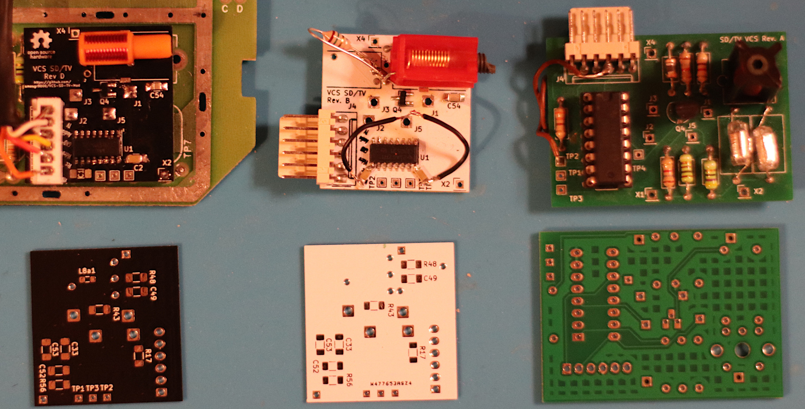
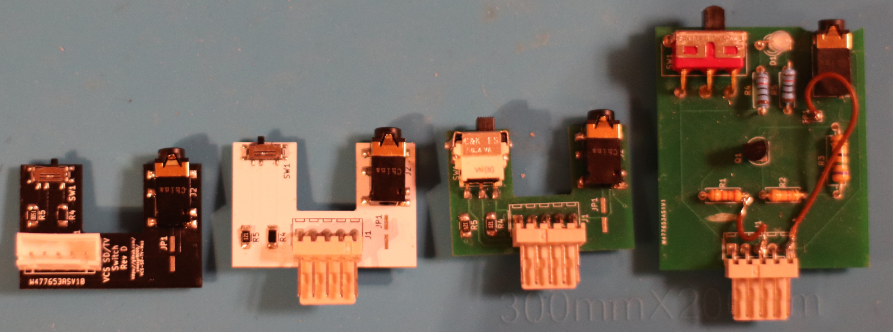
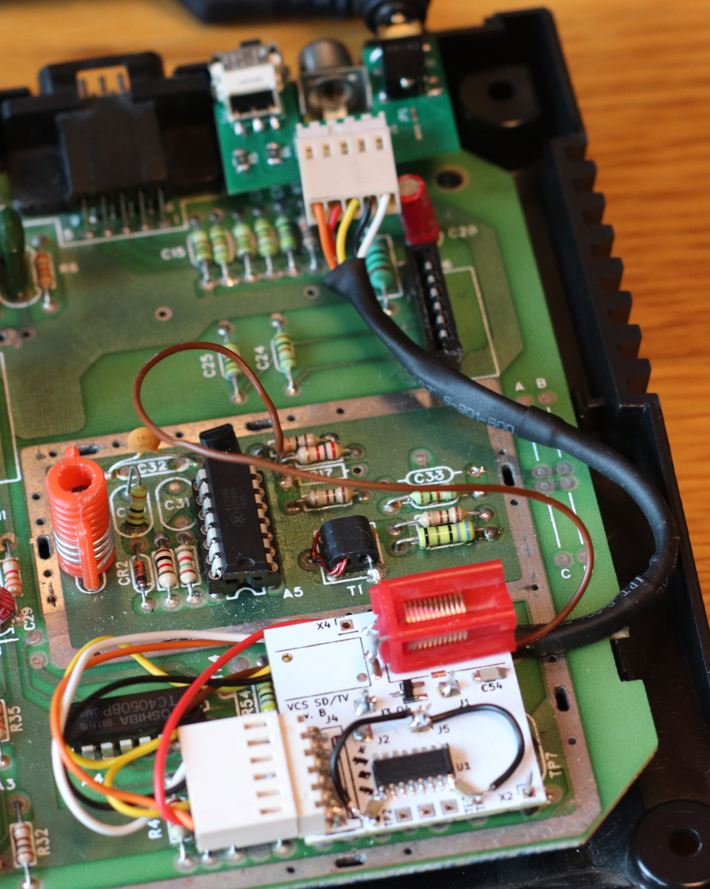

# VCS-SD-TV-Mod

VCD-SD-TV-Mod are two addon board for your **Atari VCS/2600 Jr** (Junior) game consoles. It will allow the user to **switch** between the analog **television signal** and standard definition (SD) video using a **composite video** connector. Most Mods normally remove the TV functionallity from the console.

Currently the mod is only tested on **CO21503 REV B, F** and **F1** devices! Other may likely **not** work!

- [boards](#boards)
   - [vcsboard](#vcsboard)
   - [outputboard](#outputboard)
- [build boards](#build-boards)
   - [coil configuration](#coil-configuration)
   - [cable pinout](#cable-pinout)
- [install boards](#install-boards)
   - [for A and B](#for-a-and-b)
   - [only A](#only-a)
   - [only B](#only-b)
- [setup the board](#setup-the-board)
- [license](#license)

## boards

The mod uses two boards. _vcsboard_ for the logic chip and TV functionallity. _outputboard_ for the actual switch and composite output. It is possible to use only the _outputboard_ if TV signals aren't needed.

### vcsboard

The board plays "man in the middle" and uses audio (J3), video (J2), VCC (J1) and GND (J5) from the Junior and redirect it through a switch. Then the multiplexer either forward those signals to the _outputboard_ or parts of the TV generation circuit replaced by the board itself. First iteration used the original components of the junior. But to fit the circuit under the electromagnetic shield and keep the PCB production price low most of the components are replaced by more modern smaller surface mounted parts.

_Some revision. Latest on the left_

### outputboard

The board contains the actual switch and a LED to show the current selected output type as well as the composite modulation and a 3.5mm TRS jack for outputing the signal. The pinout of the Jack is:

Part | Description
--- | ---
Tip | Video
Ring 1 | Left Audio
Ring 2 | Right Audio*
Sleeve | Groud

Be aware there are several standards cables out there. Most have ground on the sleeve thus went with this design. The RCA jacks may be connected with the "wrong" colors but will work. If your cable has ground on first or second ring the MOD will not work, have alot of noise on the display or worst destroy something (unlikly but be rather safe than sorry and test your cable before hand!)

Because the Atari VCS/2600 is mono only just the first ring has an audio signal. If you want to drive both channels with the same signal bridge the _JP1_ on the _outputboard_.

_Some revision. Latest on the left_

## build boards

there are two possibilities.

- **A** only the outputboard without TV functionallity and only composite
- **B** both boards with TV functionallity and composite

For both variants soldering is required. 

Part | For
--- | ---
C33, R17, R56, Q4 | A, B
C49, C53, C54, L8, R43, R48 | B
L6 | A (optional)
C52 | B (optional)

If you want to reuse coil L8 on the _vcsboard_ please remove this part gently. The other parts are not reused. Also be aware sometimes a second coil is also attached to L8 on the underside of the board. If you want to reuse those you have to recreate the setup on the _vcsboard_. But I would suggestion replace this setup with new coils because it could be rather cramped below the shield.

L6 for **A** is optional and could be used to bring cables to the _outputboard_. Do **NOT** remove this for **B**! C52 for **B** is optional but make it easier to install the _vcsboard_ later.

_Image of components to remove for CO21503 REV F in blue for **A** and red for **B**_

Following parts are needed for the _outputboard_:

Reference | Part | Amount | For | Additional Information
--- | --- | --- | --- | ---
D1 | Kingbright KM23ESGW | 1 | A, B (optional) | only needed if you want a LED, recommended for **B**
J1 | Amtek 2542R-05TW-L | 1 | A, B (optional) | not needed if cables are soldered directly to the PCB. Other 2.54mm socket could be e.g. a JH2.54 with 5 pins
X | Amtek 2544H-05R-L | 1 | A, B (optional) | if above is used
J2 | Tensility 54-00177 | 1 | A, B |
Q1 | Nexperia PMBT2222A | 1 | A, B | or Yangzhou MMBT2222A
R1 | Yageo RC1206JR-072K2L | 1 | A, B |
R2 | Yageo RC1206JR-073K3L | 1 | A, B |
R3 | Yageo RC1206JR-0775RL | 1 | A, B |
R4 | Yageo RC1206FR-07120RL | 1 | B (optional) | only needed if you want a LED. Resistence could be increased if red light is to bright for your taste
R5 | Yageo RC1206FR-13150RL | 1 | A, B (optional) | only needed if you want a LED. Resistence could be increased if green light is to bright for your taste
SW1 | Würth WS-SLSU 450404015514 | 1 | B |

For **A** the SW1 left and middle pad must be bridged! The jack will have no video signal if this is skipped.

Following parts are needed for the _vcsboard_ (**B**):

Reference | Part | Amount |  Additional Information
--- | --- | --- | ---
C2, C49 | Yageo CC1206KRX7R9BB104 | 2 |
C33 | Yageo CC1206JRNPO9BN101 | 1 |
C52 | Yageo CC1206JRNPO9BN470 | 1 |
C53, C54 | Panasonic ECH-U1H821GX5 | 2 |
J1, J2, J3, J5 | MPE Garry 087-1-004 | 1 | or Amphenol G800LW304032EU - cut into 4 parts, more pins can be used for X2 and X4
J4 | Amtek 2542R-06TW-L | 1 | not needed if cables are soldered directly to the PCB. Other 2.54mm socket could be e.g. a JH2.54 with 6 pins
X | Amtek 2544H-06R-L | 1 | if above is used
L8 | Coilcraft 148-13J12L | 1 | not needed if original L8 is not reused. Other Coilcraft trimable coils are possible with L8a.
L8a1 | TDK TFM201210ALMA1R5MTAA | 1 | not needed if original L8 is used or another trimable coil which fits the original coil.
Q4 | Nexperia PMBT2222A | 1 |
R17 | Yageo RC1206JR-07330RL | 1 |
R43 | Yageo RC1206JR-079K1L | 1 |
R48 | Yageo RC1206JR-0718KL | 1 |
R56 | Yageo RC1206JR-071K8L | 1 |
U1 | Texas Instruments CD4053BM | 1 |

### coil configuration
Coil L8/L8a1 should be trimable around 2µH. If L8a1 is not used both pads must be bridged! If this step is skipped the circuit is open and will not work.
Be aware there are two possible combinations of holes. The pin 1 next to X4 should always be connected. Depending on the coil you could either use the pin labled 2
(for Coilcraft 148-series or the Atari coil) or the pin further in (for Coilcraft 148-series). The pin in between is for stability only and is not
connected to any other component.
All coils should be placed axial, otherwise it will not fit under the shield. The Coilcraft 143 is the easiest to install.

If you want to use Coilcraft 148 the top pin could be bent and the other pin connected via cable or via a pin header. You may want to use some glue to fix it down.

If you want to use the original Atari coil with metal housing use two or three pin headers. Additionally you may want to use both pads to fix it down.
Please check if you have a setup were two coils where installed in parallel (one was located on the bottom of the Atari board).

### cable pinout

The cable pinout for J4 on the _vcsboard_ with recommended cable color. Every pin is labeled on PCB:
- TV Selected aka Vtv (Orange)
- VCC (Red)
- Video (Yellow)
- Ground (Black)
- Audio (White)
- TV (Brown)

The cable pinout for J1 on the _outputboard_ with recommended cable color. Every pin is labeled on back of PCB:
- TV Selected aka Vtv (Orange) **not** needed for **A**
- VCC (Red)
- Video (Yellow)
- Ground (Black)
- Audio (White)

## install boards

### for A and B
The U-shaped _outputboard_ should fit perfectly around the tv jack (J4). I would suggest to use one to three sticky 40 by 40mm foam pads 
under the _outputboard_ to put into place. Drill one or two holes to the left and right into the back of the tv jack.
The second hole is only needed if you want a LED or require the switch (**B**).

The cable length between the boards should be 20-22cm depending on route and connector used. For the TV signal (brown cable)
18cm should work fine.

Otherwise it is possible to avoid drilling by squeezing cables out of the exisiting hole at underside of the system board.

### only A
Either use the existing hole in the shield to lead the cable out on the top side or if L6 was removed connect all cables 
from the bottom and bring it to the top from the hole at L6.

Connect the follwing parts with the _outputboard_:
- VCC with Q4 right pin
- Video with R56 top pin
- Ground with R43 top pin
- Audio with C49 bottom pin

### only B
Connect _outputboard_ J1 with _vcsboard_ J4 as described above. TV to the left pin hole of the removed R17 component.
Optionally you could also install a connector here. Cut pin header into 4 pieces and solder the shorter part into:
- J1 to Q4 right pin
- J2 to R56 top pin
- J3 to C49 bottom pin
- J5 to R43 top pin

You could also add a pin header to C54 bottom pin and C49 top pin for stability.

## setup the board

Install shield again and power up the device. SD mode should work without setup. The TV mode require some tuning.
If tv signal is off turn L6 until video sginal is good again. If audio is noisy turn L8 until noise goes away. If the
audio still noisy even if the core is fully in or out. Check if your coil setup is really around 2µH or you have
a different Atari coil which had afaik 2.5µH and more and required a second coil in parallel to bring it back down to 2µH.

_older revision installed of vcsboard with Coilcraft 148 setup and outputboard_

# license

Project uses [Attribution-ShareAlike 4.0 International](./LICENSE)

